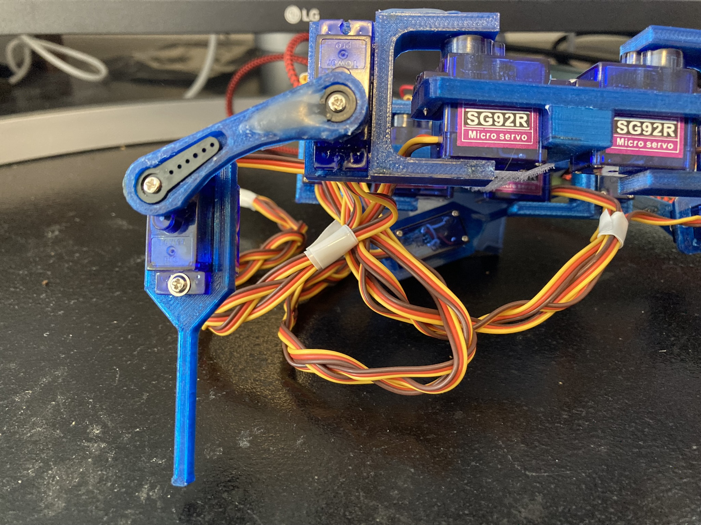

# Notes on Mounting SG92R MicroServo Motors

_One of four legs of the robot, more or less in a standing position. From the left, parts are a tibia, an ulna, and a hip. Farthest right is the hip of another leg._

## Overview

There are two basic points of connection between each motor and the body frame. The first is a rectangular hole that exactly fits the main body under the mounting lip. The second is the single point of contact with the gear which actually creates the motion.

This means there are four possible ways to mount each motor (although, as we'll see, some of them are equivalent for some parts.)

  

So the main motor can be on either side of the rectangular hole, and the gear is offset and can be on one side or other.

## The Joints

### Joint: Hip to Body

For the hip joint, the gear has to be on the outside or the joint won't fit. On the other hand, whether you mount the motor right side up or upside down doesn't matter (in terms of the hip motion), because the hip joint is symmetrical.

The only thing to keep in mind is that all the motors should be oriented one way or the other, to keep the sides balanced. Honestly, I'm not sure how much difference even that rule makes, as I haven't tried mixing them up.

### Joint: Hip to Ulna (Upper Leg)

In contrast, all four arrangments matter for this joint. The gear can be towards the top of the body, or towards the bottom; this affects the height (and possibly stability) of the robot. For now at least, I've chosen to mount them gear-down, for greater height. We'll see how it works.

Similarly, the gear can be pointing inside (towards the other leg), or outside away from the body. I've mounted the gears pointing toward the outside, to widen the stance, and reduce interference between front and rear legs on each side.

A further wrinkle: how you mount the motors will affect the code to drive the leg -- namely, does increasing the angle move the rest of the leg up, or down? Our code will have to reverse the rotation for some motors.

### Joint: Ulna to Tibia (Upper Leg to Lower)

The final joint is the lower leg, and the most important constraint is that the leg has to point down (duh). The tibia is symmetrical in the direction of the motor, so the only decision you have to make is whether the gear is on the upper side, or lower toward the "foot". I haven't found a good argument for mounting it lower. Other than that, how it attaches is already determined by how you've mounted the second motor.

## Range of Motion

Each motor has a range of motion, where the gear stops turning at a certain angle each way. You adjust the range of motion of the body part by mounting the horn on the gear at a certain angle.

I tried to set up each motor so that the range of motion of the gear matches the expected motion of the joint. Essentially I'd mount the horn on the gear and manually move the motor back and forth to the stopping points. To adjust the motion, I'd pop the horn off the gear and turn it one way or another, then press it down on the gear again. You may need tweezers or some sort of tool to help get the horn back off the gear.

## Attachment to Gear

The motors each come with two screws, and the body parts have corresponding mouting holes. There really isn't much to say about that other than the orientation as discussed above.

The attachment to the gear -- well, that's a different story. Notice that each gear attachment point has a hole for the gear, and a long shallow vaguely triangular depression in the body. The motors come with several "horns"\* which fit over the gear and extend to one side, or several, to allow connections with various parts. In particular, one horn fits over the gear and extends a triangular part in one direction -- which fits nicely into the depression in the body part.

So, all you have to do is fit the gear through the part with the depression facing up. Then we screw the horn on with the provided small screw, and the horn settles into the depression. When the gear turns, the horn efficiently transfers the force to the given part of the leg.

That's the theory. In reality, when I did that, I discovered a couple of problems. First, the part of the horn that fits over the gear is a bit longer than the hole in the part. Second, the depression is just a bit larger than the actual horn. I expect this is the inevitable result of getting your motors from different manufactures with slightly different specs.

The practical effect of that is that the connection between the motor gear and the leg part is loose, and the part is free to move both up and down the shaft, and back and forth rotationally. This makes for a very loose jointed robot, to the point that the leg becomes very unstable and the whole thing is in constant danger of falling apart.

One solution might be to redo all the parts with the thickness of the hole, and the size of the depression, adjusted to exactly fit the horns you have. I suspect that this will work, at least if the horn is of high enough quality. I haven't tried it as it means resizing a bunch of parts precisely, then re-printing them.

My first thought was: these parts are thermoplastic. If I warm the area to the point where the plastic is malleable, I might be able to reshape it to fit precisely to the horn. I don't know if you can actually do that. When I tried it, I discovered something important about the horns that came with my motors. Namely, the melting point of the plastic is lower than the melting point of the PLA thermoplastic used to print the body parts.

Scratch one body part, and one horm. Fortunately I ordered more motors than the 12 required for the robot, so I had extra. I highly recommend doing that, unless you're one of those people who gets things right on the first try. I have no idea what that would be like.

What I ended up using was a hot glue gun -- I stress again that this a prototype and doesn't have to be pretty. I was able (sometimes) to get the hot glue to fill the depression and stick to the body and the horn. I did not keep track of the number of times I had to retry it for some joints. If you've got a better solution, I'd _love_ to hear about it.

\* I have no idea why they're called that.
